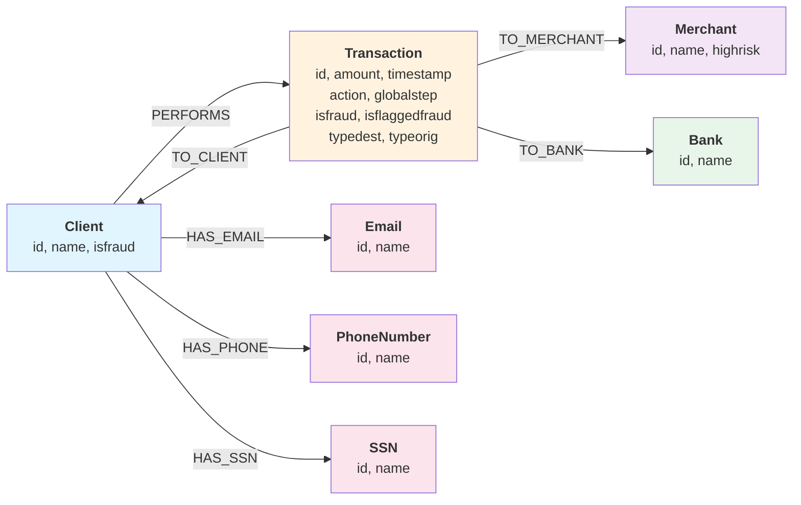

# PaySim Graph Data Processing

This project demonstrates financial fraud detection by leveraging Google Cloud Graph capabilities—specifically Spanner Graph and BigQuery Graph—combined with the visual analytics of Kineviz GraphXR. We transform PaySim transaction data into property graph format for fraud detection analysis.

## About PaySim

We build upon synthetic data generated by PaySim, the Mobile Money Payment Simulator. PaySim, originally created by Dr. Edgar Lopez-Rojas (http://edgarlopez.net), simulates authentic transaction behavior observed on a mobile money platform. The platform enables users to transfer funds between the electronic wallets on their mobile phones.

Specifically, we utilize PaySim 2, a version developed by David Voutila. After configuring the simulation with parameters such as the number of steps, clients, merchants, banks, and the probabilities of various activities, the simulation can be executed.

## Quick Start

```bash
# Clone this repository
git clone git@github.com:Kineviz/paysim.git

cd paysim

# Install and setup uv
pip install uv
uv venv --python=python3.11

.venv\Scripts\activate  # Windows; Linux/Mac: source .venv/bin/activate

# Install dependencies
uv pip install pandas google-cloud-bigquery google-cloud-spanner pandas-gbq db-dtypes

# Prepare data to be loaded to Spanner or BigQuery
uv run src/prepare_data.py
```

**Requirements:** Python 3.11, GCP credentials, CSVs generated by PaySim simulator (`data/raw/transactions.csv`, `data/raw/clients.csv`, `data/raw/merchants.csv`)

## Data Pipeline

See [Data Preparation Pipeline](src/README.md) for details. The pipeline generates:

- **Entity nodes:** Banks, Emails, PhoneNumbers, SSNs
- **PII relationships:** Client → Email/Phone/SSN
- **Transaction relationships:** Client ↔ Transaction ↔ Merchant/Bank

## Import to Cloud

- [Spanner with Schema](data-injection/spanner-schema/README.md)
- [Spanner Schema-less](data-injection/spanner-schema-less/README.md) *(Note: uses lowercase labels)*
- [BigQuery](data-injection/biguqery/README.md)

## Connect to GraphXR Explorer

Now that data is loaded in Spanner or BigQuery, and you run DDL to define a graph, you can connect GraphXR Explorer to it following instruction on Google Cloud Marketplace:

- [GraphXR Explorer for Spanner on GCP Marketplace](https://console.cloud.google.com/marketplace/product/kineviz-public/graphxr-explorer-spanner)
    - [Quick Start Guide](QuickStart_GraphXR_Explorer_Spanner.pdf)
- [GraphXR Explorer for BigQuery on GCP Marketplace](https://console.cloud.google.com/marketplace/product/kineviz-public/graphxr-explorer-for-bigquery)

Or create an account on [https://graphxr.kineviz.com/](https://graphxr.kineviz.com/) and connect to your instance.

## Graph Schema



**Nodes:** Client, Transaction, Merchant, Bank, Email, PhoneNumber, SSN  
**Edges:** PERFORMS, TO_CLIENT, TO_MERCHANT, TO_BANK, HAS_EMAIL, HAS_PHONE, HAS_SSN
