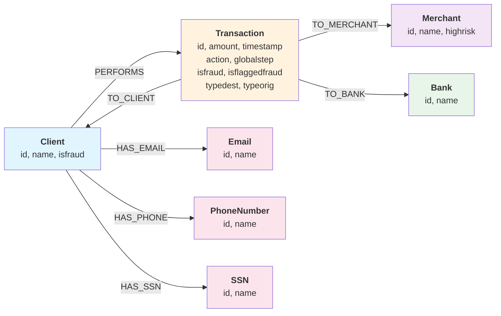

# PaySim Graph Data Processing

Transform PaySim transaction data into property graph format for fraud detection analysis.

## Quick Start

```bash
# Install and setup
pip install uv
uv venv --python=python3.11
.venv\Scripts\activate  # Windows; Linux/Mac: source .venv/bin/activate
uv pip install pandas google-cloud-bigquery google-cloud-spanner pandas-gbq db-dtypes

# Generate graph data
uv run src/data_pipeline.py
```

**Requirements:** Python 3.11, GCP credentials, PaySim CSVs (`transactions.csv`, `clients.csv`, `merchants.csv`)

## Data Pipeline

See [Data Preparation Pipeline](src/README.md) for details. The pipeline generates:

- **Entity nodes:** Banks, Emails, PhoneNumbers, SSNs
- **PII relationships:** Client → Email/Phone/SSN
- **Transaction relationships:** Client ↔ Transaction ↔ Merchant/Bank

## Import to Cloud

- [Spanner with Schema](data-injection/spanner-schema/README.md)
- [Spanner Schema-less](data-injection/spanner-schema-less/README.md) *(Note: uses lowercase labels)*
- [BigQuery](data-injection/biguqery/README.md)

## Graph Schema



**Nodes:** Client, Transaction, Merchant, Bank, Email, PhoneNumber, SSN  
**Edges:** PERFORMS, TO_CLIENT, TO_MERCHANT, TO_BANK, HAS_EMAIL, HAS_PHONE, HAS_SSN
