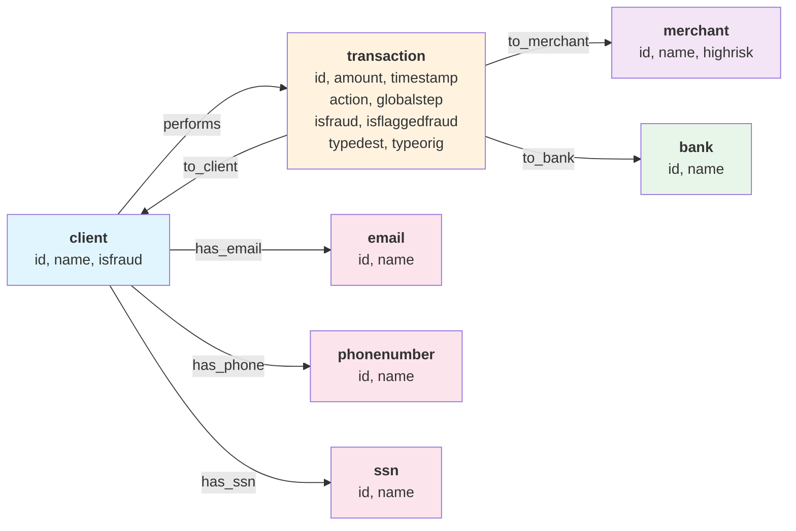

# Paysim → Spanner Schemaless Graph Import

[← Back to Home](../../README.md)

Import Paysim transaction data into Google Cloud Spanner using schemaless property graph mode.

## Prerequisites

- GCP project with Spanner instance/database
- Service account JSON key with Spanner permissions
- Python 3.8+
- Prepared CSV files from `data/processed/` (run `uv run src/prepare_data.py` if needed)

## Graph Schema (Schemaless)
> Schemaless mode uses lowercase labels only.



**Nodes:** client, transaction, merchant, bank, email, phonenumber, ssn  
**Edges:** performs, to_client, to_merchant, to_bank, has_email, has_phone, has_ssn


## Setup

**1. Configure service account:**

```powershell
cd data-injection/spanner-schemaless
cp google_auth_keyfile.example.json google_auth_keyfile.json
```

Edit `google_auth_keyfile.json` and paste your service account key.

**2. Configure import settings:**

Edit `import_paysim_schemaless.py`:

```python
instanceName = "your-instance-name"
databaseName = "your-database-name"
graphName = "your-graph-name"
```

## Run Import

```powershell
uv run  data-injection/spanner-schemaless/import_paysim_schemaless.py
```

## Test

```powershell
uv run  data-injection/spanner-schemaless/test_queries.py
```

Example query:

```sql
GRAPH paysim_schemaless_graph
MATCH (n:client)-[r:performs]->(m:transaction)
RETURN SAFE_TO_JSON(
    [TO_JSON(n), TO_JSON(r), TO_JSON(m)]
  ) as path_json
LIMIT 1
```

## Schema

**GraphNode** (vertices): `id`, `label`, `properties` (JSON)  
**GraphEdge** (edges): `id`, `dest_id`, `edge_id`, `label`, `properties` (JSON)

See `schemaless.sql` for DDL.

## Known Issues

**JSON numeric precision:** Spanner rejects certain floating-point values that cannot round-trip through string representation. Example:

```sql
SELECT JSON'{"amount": 286954.5962}' -- Error: cannot round-trip
```

**Workaround:** Round floats to 6 decimal places before insertion, or convert to integer cents.

**Label case sensitivity:** Use lowercase labels only. Uppercase labels in queries may fail:

```sql
-- ❌ Fails
MATCH (n)-[r:`HAS_PHONE`]->(m)

-- ✅ Works
MATCH (n)-[r:`has_phone`]->(m)
```

## Reference

[Spanner Schemaless Graph Documentation](https://cloud.google.com/spanner/docs/graph/manage-schemaless-data)
